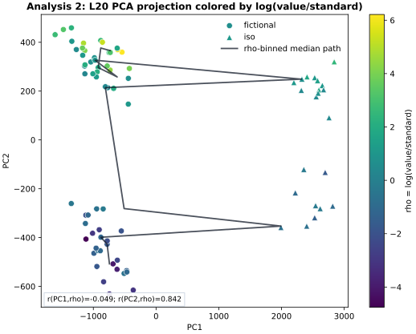

# Gradable Manifold Groups: Bierwisch Gradability as a Mechanistic Target

*Can linguistic theory pick which activation geometry is worth steering? Here it does — causally — in Gemma-3-4B.*

**Result.** Gradable-adjective semantics says "large" is judged relative to a
comparison standard, not absolute size. Used to design the contrast, that idea
locates a **rank-5 layer-20 residual-stream subspace** in Gemma-3-4B that
**causally shifts** standard-relative size judgments and **transfers
bidirectionally** across two independent prompt families. The geometry is
usable in interventions, not just readable from activations.

**Why it matters.** Before searching for circuits, features, or steering
directions, you have to know *which* behavioral variable — and *which*
activation geometry — is even worth explaining. This shows how to make that
choice principled (driven by semantic theory) instead of exploratory, then
verifies it causally. It is the question upstream of manifold steering: which
geometry is the right one to steer along.

For a self-contained write-up (one-page note plus technical appendix), see
[`docs/GRADABLE_MANIFOLD_ONE_PAGER.md`](docs/GRADABLE_MANIFOLD_ONE_PAGER.md).

This work is a companion to the [SAE/CLT writeback limitation paper](https://github.com/Sapphire-Bridge/sae-writeback-limitation/blob/main/paper/sae_writeback_limitation_short_paper.md). That paper is published first; this repository is
released after it.

## Abstract

This project asks whether linguistic theory can help identify the right thing to
look for inside a language model. The case study is deliberately simple: when a
model judges whether something is "large," the relevant variable is not the
object's absolute size but its size relative to a comparison standard — a 3 cm
object can be large for one class and small for another. Using that idea, the
project builds controlled standard-relative size-judgment prompts and tests
whether Gemma-3-4B (revision `cc012e0`) contains an activation geometry that
causally supports this behavior. (Behavior is read out as prompt-deduplicated
ordered probability over the labels `tiny < small < large < huge`, not as
argmax accuracy.)

The main result is that it does. In this one model and prompt/readout regime, a
small layer-20 residual-stream subspace shifts standard-relative size judgments:
a rank-5 PCA subspace learned from one size-prompt family transfers to a
held-out size-prompt family, and the reverse direction works too. That makes the
result stronger than a probe or correlation — the geometry is not only readable
from activations but usable in interventions that move behavior.

The interpretation is deliberately narrow. Cross-domain tests with temperature
and age show partial overlap with size, but no single universal gradability
basis. A steering test shows the discovered size geometry can be used for local
linear control; in that fixed-vector steering regime the comparison-standard
direction is an even stronger local actuator — yet in the more controlled
donor-conditioned patching, the explicit `value`, `standard`, and
`value`+`standard` controls are all near zero. So the claim is not "we found the
gradability manifold" or "`rho` is the mechanism." The claim is narrower:
semantic theory defined a causally testable variable, and that variable exposed
an emergent low-dimensional activation geometry for standard-relative size
judgments.

This matters for mechanistic interpretability because it addresses an upstream
problem: before searching for circuits, features, or steering directions, we
need to know which behavioral variable is worth explaining. The project shows
one way to make that choice principled rather than purely exploratory, then
tests it causally with patching, matched controls, cross-domain stress tests,
and artifact-bound claim checks.

## What the language theory contributes

The central methodological claim is not that bottom-up analysis is useless. It
is that Bierwisch-style gradable semantics specifies the contrast that should be
tested before any mechanistic search begins: the model should track a value
relative to a comparison standard, not absolute size alone.

That theory choice creates the data geometry and the falsification controls:
same target values can receive different judgments under different standards;
temperature and age should be relevant cross-domain tests if the abstraction is
really gradable calibration rather than a size-only artifact; and naive
explicit-variable controls should fail if the effect is not just a separable
`value` or `standard` direction.

| Candidate variable or control | Why a bottom-up reader might try it | Result in this study |
| --- | --- | --- |
| Absolute `value` | Obvious scalar feature: bigger values should mean bigger judgments. | Near-zero causal control in the primary L20 size patch report; absolute value alone does not explain the A/B judgment shift. |
| `standard` alone | The comparison class visibly changes across prompts. | Near-zero causal control; the standard alone is not the patchable mechanism. |
| `value_standard_2d` | Naive compositional control: linearly combine value and standard directions. | Near-zero causal control; the learned patchable structure is not the explicit 2D variable pair. |
| Standard-relative contrast `rho = log(value/standard)` | Bierwisch-style theory says this is the relevant semantic coordinate. | Defines the contrast family in which the L20 pca-k5 causal subspace is found. |
| Cross-domain gradability | Theory predicts size, temperature, and age share value-standard structure. | Partially true but asymmetric: temperature/age deltas activate `U_size`, while source-trained bases do not robustly replace it. |

So the result is not "theory proves the manifold." The result is narrower:
theory asks the right intervention question and exposes a precise mismatch
between clean semantic structure and the model's learned geometry.

## Relation to manifold steering

This work is adjacent to manifold-steering work, but it makes a narrower
claim. Manifold steering asks whether control should follow the learned geometry
of representation and behavior rather than assume a single flat direction. This
study asks an upstream question: how do we choose the candidate conceptual
coordinate to test in the first place?

Bierwisch-style gradable semantics supplies that candidate coordinate:
standard-relative contrast, `rho = log(value/standard)`. The mechanistic test is
then whether Gemma-3-4B contains a causally patchable residual-stream geometry
aligned with that semantic contrast.

| Manifold-steering framing | This study |
| --- | --- |
| Find the right geometry rather than only the right direction. | Use language theory to choose the candidate coordinate before the geometry search. |
| Fit or compare activation and behavior manifolds. | Test a local L20 low-rank residual geometry against standard-relative judgments. |
| Manifold-respecting paths should produce natural behavior trajectories. | Patching through the L20 size basis shifts held-out size judgments in the predicted direction. |
| Shared geometry can link representation and behavior. | Cross-domain probes show partial shared calibration, but not an interchangeable rank-5 basis across domains. |

The current result should therefore be read as a semantics-first causal test of
the manifold-steering agenda, not as a full manifold-steering result. It supports
a domain-preferential size-calibration geometry: `U_size` can partially read
matched temperature/age scalar-calibration deltas, but temperature/age-trained
bases do not robustly replace `U_size`.

## Main result

| Test | Key result | Interpretation |
| --- | --- | --- |
| Size low-rank transfer, fictional -> iso | L20 pca-k5 aligned effect `+0.162 [0.110, 0.209]`, recovery/full `0.860 [0.595, 1.146]` | A small size subspace causally transfers to a held-out size operationalization. |
| Reverse size transfer, iso -> fictional | L20 pca-k5 aligned effect `+0.155 [0.127, 0.187]`, recovery/full `0.591 [0.492, 0.703]` | The size result is bidirectional, not a one-way prompt artifact. |
| Matched cross-domain deltas through `U_size` | temperature `+0.081 [0.043, 0.118]`; age `+0.070 [0.042, 0.097]` | The size basis is not strictly size-specific. |
| Source-state bases -> size | temperature `+0.028 [0.017, 0.039]`; age `+0.006 [-0.001, 0.013]` | Source activation-state bases do not substitute for the size basis. |
| Source-delta bases -> size | temperature `+0.032 [0.020, 0.045]`; age `-0.000 [-0.005, 0.005]` | There is no robust shared rank-5 contrast basis across size, temperature, and age. |
| Fixed-vector size steering | L20 pca-delta-mean slope/alpha `+0.029 [0.026, 0.032]`; positive slope rate `1.000`; random norm-matched slope `+0.005 [0.003, 0.008]`; sham `0.000` | The size geometry can be used as a real linear steering direction. The stronger `standard` control (`+0.044 [0.042, 0.046]`) suggests comparison-standard calibration is a major local actuator, so this is not a rho-only steering claim. |

## Manifold-claim diagnostics

This repository includes four data-derived figures for the paper claim:



- `figures/manifold_groups/cross_variant_subspace_overlap.svg` - the direct
  same-subspace test. L20 angles are `33.1, 49.0, 74.2, 77.7, 84.9` degrees,
  so bidirectional transfer should not be described as literal identity of
  independently fitted rank-5 bases.
- `figures/manifold_groups/l20_pca_rho_projection.svg` - L20 activation
  projection colored by `rho = log(value/standard)`. `rho` loads mainly on PC2,
  not PC1.
- `figures/manifold_groups/transfer_efficiency_by_delta_rho.svg` - pca-k5
  transfer as a function of `|delta rho|`; recovery does not collapse at larger
  scalar distances in the current bins.
- `figures/manifold_groups/layer_trajectory.svg` - activation geometry across
  cached layers and causal pca-k5 effects for the layers with existing patch
  runs.

Full table output: `results/manifold_groups_poc/gradable_manifold_claim_diagnostics.md`.

## Claim-number gate

The headline numbers above are pinned in
[`tables/gradable_release/claim_numbers.json`](tables/gradable_release/claim_numbers.json),
each bound to the source artifact and JSON path it comes from. The gate
re-derives every bound number from its artifact (rounded to 3 dp) and asserts
the canonical display strings still appear in this README and the one-pager, so
the prose cannot silently drift from the data:

```bash
python scripts/check_gradable_claim_numbers.py
```

Convenience targets are in the `Makefile`:

```bash
make gradable-check     # claim-number gate + gradable unit tests
make gradable-dry-run   # the four documented model-free dry-runs (read-only)
```

## Claim discipline

Supported:

- Bierwisch-style semantics gives a controlled causal target: standard-relative
  gradable judgment.
- The size domain has a low-rank L20 causal subspace in this model and
  prompt/readout regime.
- The size subspace transfers bidirectionally across two size
  operationalizations.
- A fixed L20 steering direction derived from train-set high-`rho` minus
  low-`rho` size contrasts monotonically shifts held-out size judgments.
- Cross-domain probes falsify both a strictly size-specific interpretation and
  a strong universal shared-basis interpretation.

Not supported yet:

- A universal gradability manifold across size, temperature, and age.
- Model-general behavior beyond `google/gemma-3-4b-pt` at revision `cc012e0`.
- A strict manifold claim in the curved-geometric sense.
- A rho-only steering mechanism: in the fixed-vector steering run, the
  comparison-standard direction is stronger than the pca-delta-mean direction.
- SAE/CLT feature-group recovery of the discovered subspace.

## Why this work matters

Philosophical semantics is not decoration here; it generates both the
intervention variable and the falsification controls. Bierwisch predicts a
shared value-standard structure across gradable domains, and the model only
partially respects that abstraction. That mismatch is the result: concept-first
interpretability can discover where LLM mechanisms diverge from clean semantic
theory.

Short pitch:

> Philosophy helps define the variable worth intervening on, and the controls
> worth running.

## Start here

- `results/manifold_groups_poc/gradable_predicates_bierwisch_note.md` -
  extended narrative research note (supporting; not claim-gated — the README and the one-pager are the pinned claim surface).
- `results/manifold_groups_poc/gradable_size_v2_runbook.md` - operational
  runbook with commands, gates, and result interpretation.
- `results/manifold_groups_poc/gradable_cross_domain_low_rank_control_l20_r5_gemma3.md` -
  matched temperature/age deltas projected through the size basis.
- `results/manifold_groups_poc/gradable_cross_domain_subspace_transfer_l20_r5_gemma3.md` -
  source-state PCA bases applied to size deltas.
- `results/manifold_groups_poc/gradable_cross_domain_delta_basis_transfer_l20_r5_gemma3.md` -
  source-delta PCA bases applied to size deltas.
- `results/manifold_groups_poc/gradable_size_semantic_steering_l20_r5_gemma3.md` -
  fixed-vector size steering alpha sweep and controls.

## Reproduce the cross-domain controls

Run from the repo root after installing `requirements.txt` and ensuring the
pinned Gemma snapshot is available locally or through Hugging Face access.

> **No model weights are included in this repository.** The runs use
> `google/gemma-3-4b-pt` at revision `cc012e0`, which you must obtain separately
> via Hugging Face under Google's [Gemma terms of
> use](https://ai.google.dev/gemma/terms). Only derived activations, results,
> and figures are committed here. See [`NOTICE`](NOTICE) for the Gemma notice.

```bash
TOKENIZERS_PARALLELISM=false DEVICE=mps TORCH_DTYPE=float32 LAYERS=20 RANK=5 ALPHAS=1.0 RANDOM_REPEATS=20 BOOTSTRAP_B=1000 bash scripts/run_gradable_cross_domain_low_rank_control.sh
TOKENIZERS_PARALLELISM=false DEVICE=mps TORCH_DTYPE=float32 LAYERS=20 RANK=5 ALPHAS=1.0 RANDOM_REPEATS=20 BOOTSTRAP_B=1000 bash scripts/run_gradable_cross_domain_subspace_transfer.sh
TOKENIZERS_PARALLELISM=false DEVICE=mps TORCH_DTYPE=float32 LAYERS=20 RANK=5 ALPHAS=1.0 RANDOM_REPEATS=20 BOOTSTRAP_B=1000 bash scripts/run_gradable_cross_domain_delta_basis_transfer.sh
```

Offline/input-readiness checks that do not load the model:

```bash
DRY_RUN=1 DEVICE=cpu TORCH_DTYPE=float32 bash scripts/run_gradable_cross_domain_low_rank_control.sh
DRY_RUN=1 DEVICE=cpu TORCH_DTYPE=float32 bash scripts/run_gradable_cross_domain_subspace_transfer.sh
DRY_RUN=1 DEVICE=cpu TORCH_DTYPE=float32 bash scripts/run_gradable_cross_domain_delta_basis_transfer.sh
```

## Semantics-derived size steering

The low-rank patching results above are donor-conditioned interventions. The
steering follow-up uses a fixed-vector alpha sweep:

```text
h' = h + alpha * s * d
```

Here `d` is derived from train-set high-`rho` minus low-`rho` size contrasts,
projected into the L20 train PCA rank-5 basis by default; `s` is the primary
pca-delta-mean train-pair delta scale shared by non-sham directions. Positive
alpha is oriented toward larger standard-relative size judgments.

Full result:
`results/manifold_groups_poc/gradable_size_semantic_steering_l20_r5_gemma3.md`.

| Direction | Curve result | Interpretation |
| --- | --- | --- |
| `pca_delta_mean` | slope/alpha `+0.029 [0.026, 0.032]`, positive slope rate `1.000` | Real fixed-vector steering from the theory-built size geometry. |
| `random_norm_matched` | slope/alpha `+0.005 [0.003, 0.008]`, positive slope rate `0.559` | Much weaker than the primary direction under 20 random repeats. |
| `sham` | `0.000 [0.000, 0.000]` | Hooking/scoring control is clean. |
| `standard` | slope/alpha `+0.044 [0.042, 0.046]`, positive slope rate `1.000` | Stronger than `pca_delta_mean`; interpret the mechanism as comparison-standard calibration, not rho-only steering. |
| `value` / `value_standard_2d` | negative slopes `-0.055` and `-0.058` | These controls steer reliably but opposite the rho-oriented direction. |

This is best framed as a semantics-first local tangent-space result: language
theory defines the contrast family that exposes a steerable size-calibration
geometry, while the strongest local one-dimensional actuator is tied to the
comparison standard.

Offline/input-readiness check:

```bash
DRY_RUN=1 DEVICE=cpu TORCH_DTYPE=float32 bash scripts/run_gradable_size_steering.sh
```

Full run:

```bash
TOKENIZERS_PARALLELISM=false DEVICE=mps TORCH_DTYPE=float32 LAYERS=20 RANK=5 ALPHAS=-2,-1,-0.5,0,0.5,1,2 RANDOM_REPEATS=20 BOOTSTRAP_B=1000 bash scripts/run_gradable_size_steering.sh
```

Output prefix:
`results/manifold_groups_poc/gradable_size_semantic_steering_l20_r5_gemma3`.
This is linear residual-stream steering, not geodesic manifold steering.

## Row-level audit artifacts

Alongside the curated `.md` and `.summary.json` files, this repository also
tracks the moderate row-level CSVs for the steering and cross-domain control
runs (each a few MB), so most per-row reanalysis needs no model rerun.

Two very large low-rank patch row-level CSVs are **not** included, to keep the
repository lean. They are listed here with size and SHA256 so they can be
regenerated and verified, or distributed separately as release assets:

| External artifact (not in repo) | Rows | Bytes | SHA256 |
| --- | ---: | ---: | --- |
| `gradable_size_low_rank_patch_train_fictional_semantic_adjective_counts_eval_iso_ratio_adjective_counts_l162024_normmatched_r20_gemma3.csv` | 18,217 | 10,566,410 | `9cf0cb89667445a76ac287d0382f3b0d788afe2c707a93ff5a10e3441dca91af` |
| `gradable_size_low_rank_patch_train_iso_ratio_adjective_counts_eval_fictional_semantic_adjective_counts_l162024_gemma3.csv` | 67,321 | 39,763,250 | `9a234acdce24819b0b5faf3d65b969e46953a220ac6375ea8ff965a8f026d735` |

These CSVs support per-direction/per-pair heterogeneity checks, outlier audits,
bootstrap reanalysis, and future row-level reanalysis without rerunning the
model. Their size, byte count, SHA256, model revision, and exact generator
command are recorded in
[`results/manifold_groups_poc/GRADABLE_RELEASE_MANIFEST.json`](results/manifold_groups_poc/GRADABLE_RELEASE_MANIFEST.json).

## What not to overclaim

This is shareable as a focused Gradable/Manifold evidence release, not as a
completed SAE/CLT feature-group story. The same-rho/off-pair size-internal
control, paraphrase-transfer test, second-model replication, and SAE/CLT group
recovery remain follow-up work.
